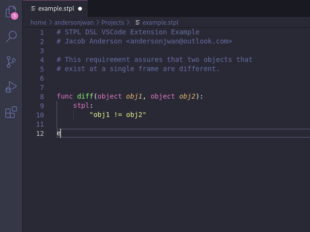

# PyFoReL Language Support

The **PyFoReL Language Support** is a [Visual Studio Code](https://code.visualstudio.com/) extension that assists in the development of Temporal Logic-based requirements within the Domain-Specific Language found [here](https://gitlab.com/sbtg/pyforel).

## Features

The extension currently supports the essential set of language development features such as bracket matching, syntax highlighting, code snippet insertion, and auto-completion. The complete list of detailed features are listed below:

- Language Configurations
    - Toggling Line Comments
    - Bracket Matching
    - Auto-closing Brackets
    - Surrounding Selections in Brackets
    - Automatic Indentation
- Syntax Highlighting
    - Control Flow
    - Function Definitions
    - Temporal Operators
    - Numbers (Integers/Floats)
- Code Snippets
    - If, Elif, Else constructs
    - Function declaration constructs
    - FrozenTime constructs
    - And more!
- Auto-Completion
    - Temporal operators (globally, eventually, next, etc.)
    - Control flow keywords
    - Temporal keywords
    - And more!
